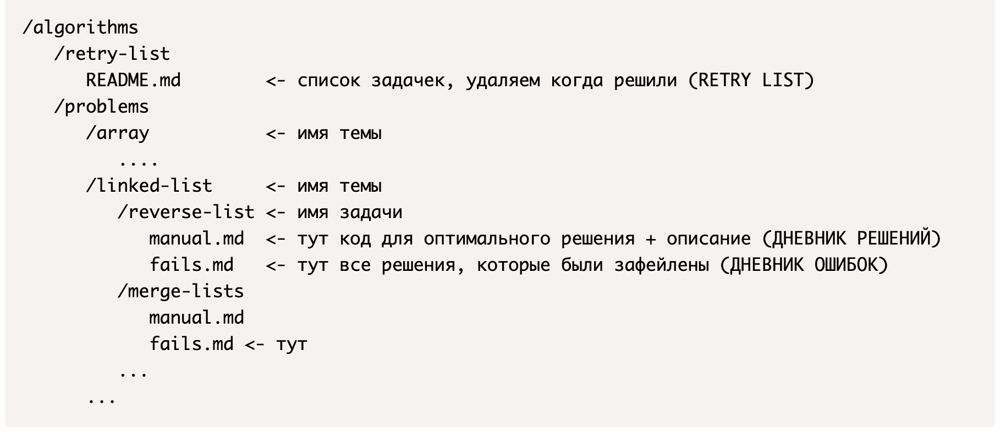

# RETRY LIST, ДНЕВНИК ОШИБОК и РЕШЕНИЙ. Что это?

**Где вести все дневники**

Советую для этого использовать GitHub или GitLab и хранить все там. можно организовать структуру папок так:

- ### ДНЕВНИК РЕШЕНИЙ

Пожалуй, это самый главный из дневников, его смысл:

- зафиксировать правильное решени
- оценка по времени и памяти
- путь по которому вы пришли к решению

Этот дневник в дальнейшем будет служить вашей шпаргалкой на собеседованиях если вы что-то забыли(чужой дневник не может быть хорошей шпаргалкой, а свой - еще как может)

Следует соблюдать структуру:

- решение
- оценка по времени
- оценка по памяти
- ваши объяснения

**Пример ДНЕВНИКА РЕШЕНИЙ (для задачи 1. Two Sum)**

**Оценка по времени:** O(n), где n - размер списка nums

_Объяснения:_ делаем 1 проход по массиву, который образует n итераций, а на каждой итерации работаем со словарем, поиск и вставка в словаре работают за O(1), поэтому оценка по времени O(n)

**Оценка по памяти:** O(n), где n - размер списка nums

_Объяснения:_ самый худший случай, когда ответ - последние 2 элемента. В этом случае у нас в словаре будут находится n-1 элементов, поэтому оценка по памяти O(n) (O(n), а не O(n-1) т к в big O нотации константы принято опускать)

**Описание решения**

Используем словарь для хранения позиции каждого элемента, где ключ - значение элементы массива, значение - позиция элемента. Eсли находим в словаре элемент равный target - nums[i], значит есть пара дающая в сумме target и возвращаем позицию элементов

- ### Дневник ошибок

Смысл данного дневника завиксировать вообще все свои провальные отправки, а потом по возможности к ним вернуться и написать внизу каждой отправки что было не так.

Когда вы зафиксируете что было не так, то с большой вероятностью перестанете допускать такую ошибку в дальнейшем, а значит и шанс на отправку без ошибок вырастет

- ### RETRY LIST

Это список задач, для которых вы не смогли придумать решение вообще в течении 30 минут. Туда кладем задачки сразу как не смогли решить (советую в READ.me группировать их по темам). Следует вернуться к этим задачкам через 1-2 дня и желательно еще раз через неделю-две, потом задачу из списка можно удалить если решение больше не вызывает никаких проблем

