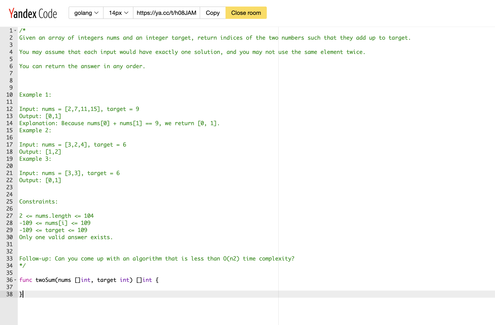

# Как решать задачи на курсе, чтобы это все было не зря

Полезные ссылки

[Yandex code](https://code.yandex-team.ru)

**Почему важно решать по алгоритму ниже?**

Главная цель курса - прокачать ваш мозг для алгоритмических задачек и успешное прохождение будет следствием, поэтому тебе важно учитывать следующее:

- **КАЖДАЯ “ОТПРАВКА КОДА”** может сказаться сильно на успешность прохождения секции и заспамить интервьюера решениями не получится (а ты скорее всего так делаешь на leetcode :)

- на собеседовании нельзя подглядеть куда-то (точнее можно, но это только прибавит стресса в большинстве ситуаций и твой мозг зациклится на том что увидел, а не на решении)

- на собеседовании нужно не молчать, а активно проговаривать решение

- на собеседовании чаще всего нельзя включить дебаггер, а если и можно, то это сразу жирный минус если не провал всей секции

Хорошо, мы разобрались, что у собеседований есть своя специфика, поэтому нужно постараться максимально приблизится к условиям на собесе и cделать это можно так:

**План**

1. Ставишь таймер. **ДА, ЭТО ВАЖНО!**
    - таймер нужно ставить на **20 минут** (к этому времени нужно придумать хотя бы одно решение)
    - на 30 минуте должна быть решена задача

2. Открываешь задачу на leetcode и копируешь условие, примеры входных и выходных данных, ограничения (constraints) от туда в Yandex Code как комментарий + функцию/класс, который нужно написать или делаешь скриншот и смотришь на условие там. Вот пример для задачи 1. Two Sum (~1 мин.)

3. Читаешь условие (~1.5 мин.)

4. Смотришь примеры и генерируешь один-два дополнительных тестовых кейсов и обязательно их записываешь (~0.5 мин.)

5. Думаешь над идеей (~5-20 мин.)
    - Думаешь над идеей и активно зарисовываешь/записываешь свои мысли, чтобы было проще думать. Даже не оптимальные решения можно записать если не получается придумать другой способ
    - Оцениваешь свое решение по времени и памяти и **ЗАПИСЫВАЕШЬ** это комментарием в коде
    - Думаешь можно ли оптимальнее и если кажется, что можно, то идешь к пункту a
    - Если 20-30 минут прошло, а идей 0, то сразу идем к пункту 7 и смотрим чужие решения и разбираемся, советую добавить эту задачу в **RETRY LIST**, (что это такое и как пользоваться расскажу в другой статье)

6. Пишешь код, даже если придумал не оптимальное решение, но время вышло (~5-10 мин.)
    - Пишешь код
    - Проверяешь только логику кода
    - Проверяешь только синтаксис
    - Если решение не прошло тест, то нужно занести это решение в **ДНЕВНИК ОШИБОК** (что это и зачем это нужно можно прочитать в другой статье)

7. Останавливаешь таймер

8. Убедится, что решение оптимально. Это можно сделать используя leetcode или в чатике спросить

9. Посмотреть другие решения. И если видите более “красивое” на ваш взгляд решение, то разобраться в нем

10. Сохранить свое решение в ДНЕВНИК УСПЕШНЫХ РЕШЕНИЙ (что это и зачем это нужно можно прочитать в другой статье)

11. Поздравляю, ты круто справился. Обязательно поделись своим ДНЕВНИКОМ УСПЕШНЫХ РЕШЕНИЙ в чатике в конце недели

